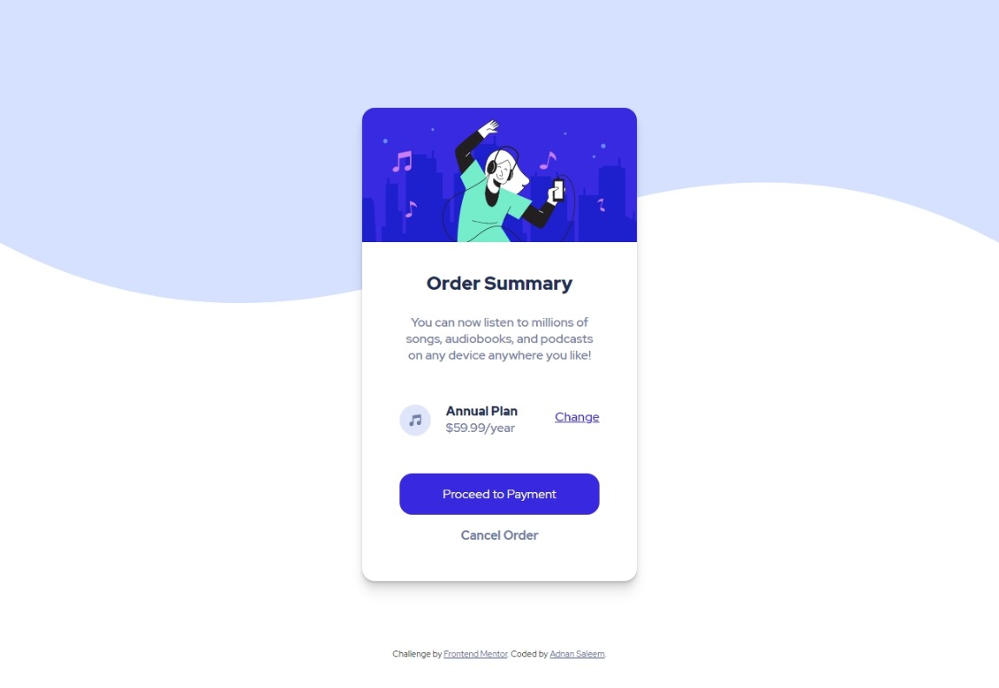
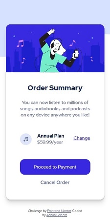

# Frontend Mentor - Order summary card solution

This is a solution to the
[Order summary card challenge on Frontend Mentor](https://www.frontendmentor.io/challenges/order-summary-component-QlPmajDUj).
Frontend Mentor challenges help you improve your coding skills by building realistic projects.

## Table of contents

- [Frontend Mentor - Order summary card solution](#frontend-mentor---order-summary-card-solution)
  - [Table of contents](#table-of-contents)
  - [Overview](#overview)
    - [The challenge](#the-challenge)
    - [Screenshot](#screenshot)
    - [Links](#links)
  - [My process](#my-process)
    - [Built with](#built-with)
    - [What I learned](#what-i-learned)
    - [Continued development](#continued-development)
    - [Useful resources](#useful-resources)
  - [Author](#author)

## Overview

An HTML and CSS responsive project for displaying order summary

### The challenge

Users should be able to:

- See hover states for interactive elements

### Screenshot

### Links

- Solution URL:
  [https://github.com/Adnan-Saleem-93/Order-Summary-Frontend](https://github.com/Adnan-Saleem-93/Order-Summary-Frontend)
- Live Site URL:
  [https://order-summary-adnan-frontendmentor.netlify.app/](https://order-summary-adnan-frontendmentor.netlify.app/)

## My process

I built this project simple HTML and CSS (no external libraries were used).

### Built with

- HTML5
- CSS
- Semantic HTML5 markup (partially used)
- Mobile-first workflow

### What I learned

I learned about designing and making website responsive using media queries.

### Continued development

I want to enhance my knowledge about how certain css properties, css units and media queries work,
improve usage of the box-shadow property and proper implementation of flexbox and grid.

### Useful resources

[HTML & CSS](https://www.w3schools.com/)

## Author

- Website - [Adnan Saleem](https://github.com/Adnan-Saleem-93)
- Frontend Mentor - [@Adnan-Saleem-93](https://www.frontendmentor.io/profile/Adnan-Saleem-93)
